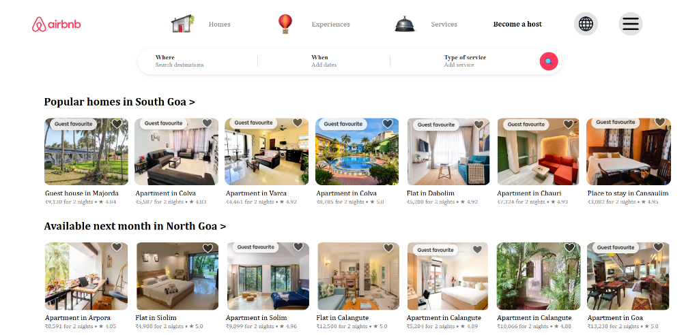
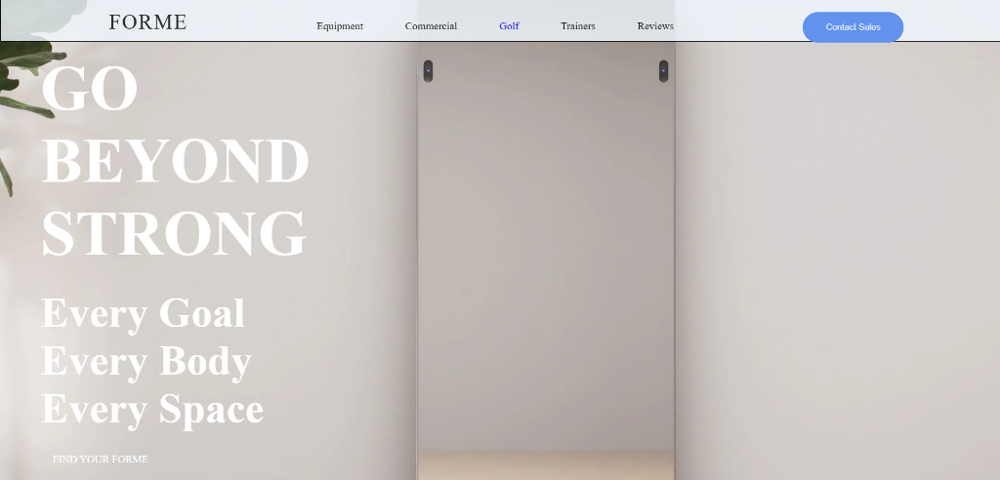
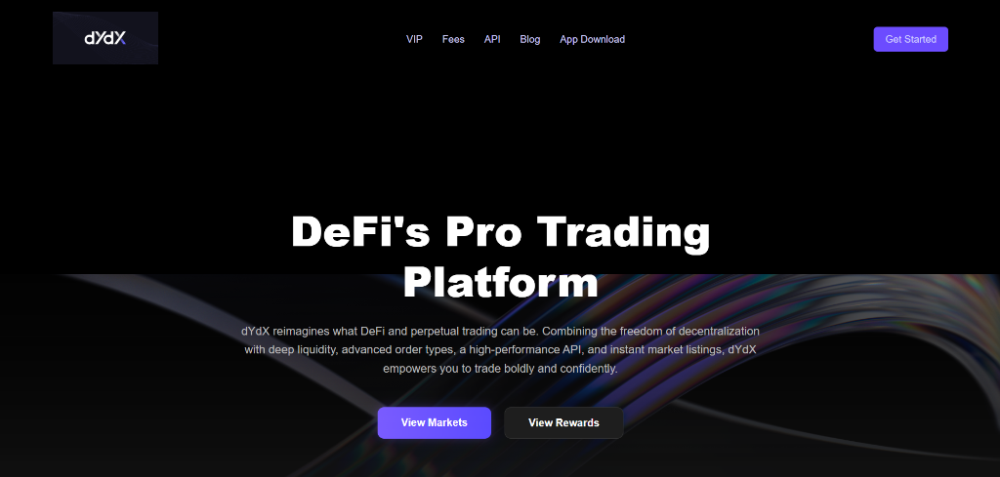
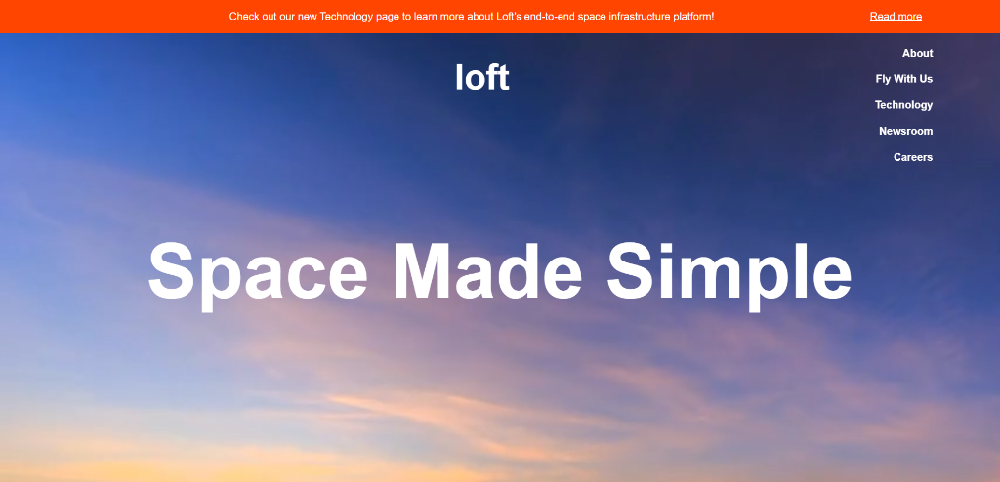
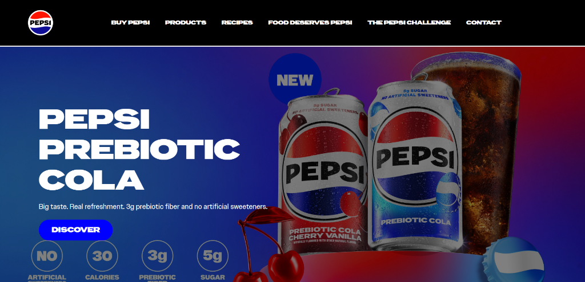
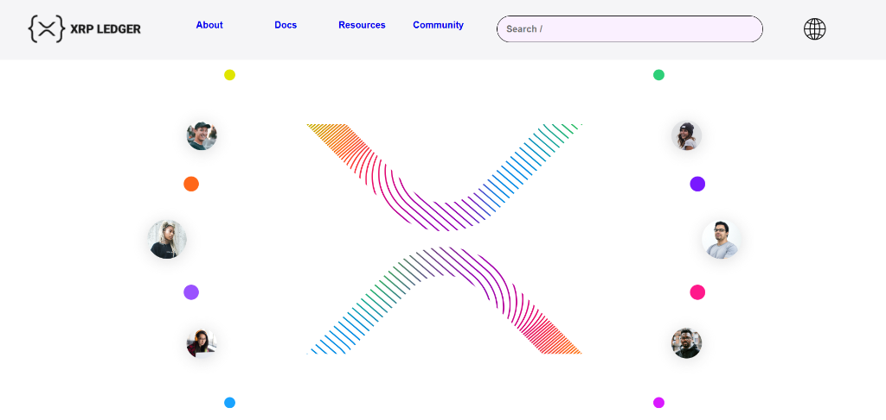

# ⬡ Web Clones Portfolio


A curated frontend portfolio consisting of **6 pixel-perfect HTML & CSS replicas** of popular websites across various industries. This project demonstrates strong mastery over core web fundamentals, responsive design, and raw layout structuring without relying on heavy frameworks.

---

## 🌟 The Clones

Each website in this collection has been independently developed and deployed. Click the links below to view the live demonstrations.

| Preview | Project & Niche | Live Link |
| :---: | :--- | :--- |
| <a href="https://bright-salamander-ca9508.netlify.app/"></a> | **AirBnb**<br>Travel & Accommodation | [Live Demo ↗](https://bright-salamander-ca9508.netlify.app/) |
| <a href="https://forme123.netlify.app/"></a> | **Forme**<br>Wellness & Fitness | [Live Demo ↗](https://forme123.netlify.app/) |
| <a href="https://dydx123.netlify.app/"></a> | **dYdX**<br>DeFi & Crypto Trading | [Live Demo ↗](https://dydx123.netlify.app/) |
| <a href="https://loftorbital123.netlify.app/"></a> | **Loft Orbital**<br>Space Technology | [Live Demo ↗](https://loftorbital123.netlify.app/) |
| <a href="https://pepsiclone123.netlify.app/"></a> | **Pepsi**<br>FMCG & Brand | [Live Demo ↗](https://pepsiclone123.netlify.app/) |
| <a href="https://xrpledger123.netlify.app/"></a> | **XRP Ledger**<br>Blockchain Hub | [Live Demo ↗](https://xrpledger123.netlify.app/) |

## 🚀 Overview

The root of this repository contains a central **Navigation Hub** (`index.html`) that serves as a beautiful landing page connecting all 6 projects together effortlessly. 

### Key Features
- **Zero Frameworks:** Completely built using core HTML5 and CSS3. 
- **Responsive Layouts:** Utilizes Modern Flexbox and CSS Grid paradigms to ensure fluid layouts across devices.
- **Micro-Animations:** Custom hover states, glowing background cards, and keyframe animations implemented in pure CSS.
- **Independent Deployments:** Each web clone is self-contained and independently deployed on Netlify for rapid delivery.

## 📂 Project Structure

```text
📦 sixWebSites
 ┣ 📂 AirBnb               # AirBnb Homepage, Experiences, Services
 ┣ 📂 Forme                # Wellness Brand with minimal aesthetic
 ┣ 📂 dydx                 # Crypto Exchange with sign up/in flows
 ┣ 📂 loftOrbital          # Satellite as a Service futuristic UI
 ┣ 📂 pepsi                # Vibrant consumer site structure
 ┣ 📂 xrp-ledger           # Blockchain dev portal
 ┣ 📜 index.html           # Main Portfolio Hub
 ┣ 📜 netlify.toml         # Root Deployment Configuration
 ┗ 📜 README.md
```

## 🛠️ Running Locally

1. **Clone the repository:**
   ```bash
   git clone <your-repository-url>
   ```
2. **Navigate to the core directory:**
   ```bash
   cd sixWebSites
   ```
3. **Launch the Portfolio:**
   - Simply double-click the `index.html` file to open it in your default browser.
   - *OR*, if using VS Code, use the **Live Server** extension to launch `index.html` on a local development port.

## 🚢 Deployment

The central Hub (`index.html`) is configured to deploy directly to Netlify leveraging the zero-build configuration inside `netlify.toml`. The individual website clones have been deployed securely on separate independent Netlify projects, and are flawlessly accessible directly via the Navigation Hub's UI.

---
*Built with passion and focus on UI/UX fundamentals.*
